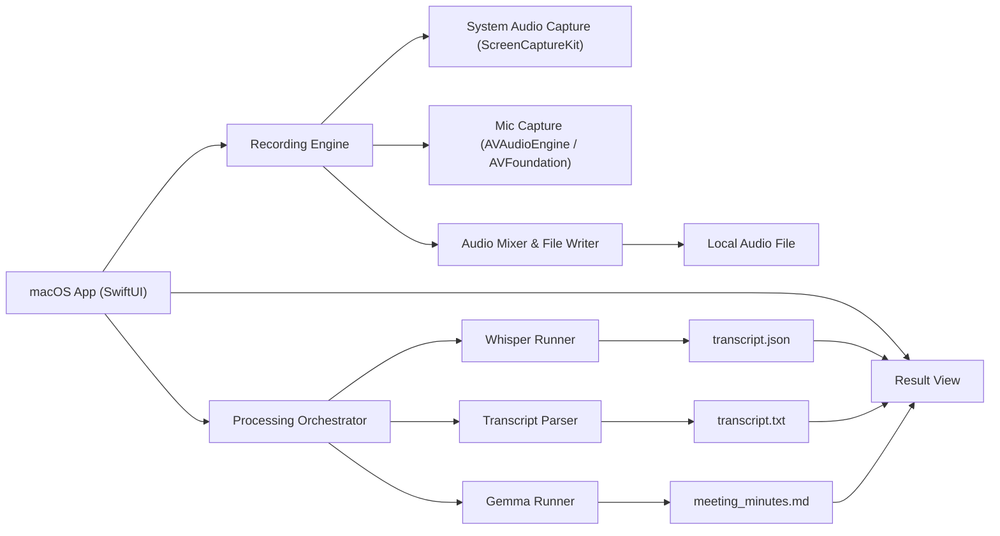

# 会议纪要产品 MVP 方案定稿

## 产品定位

本产品的目标不是包装一个 CLI，而是做一个体验完整的本地会议纪要工具。

核心能力：

1. 录制系统声音
2. 录制麦克风声音
3. 自动转写为 transcript
4. 自动生成结构化会议纪要
5. 展示、复制、导出结果

---

## 产品形态

产品形态锁定为：**macOS 原生桌面应用**

当前工程实现口径：

- 最低目标系统版本：`macOS 15`

原因：

1. 需要处理系统声音录制与麦克风录制，这天然更适合原生权限体系。
2. 后续需要处理屏幕录制权限、系统音频采集、设备枚举、状态显示，这些在 macOS 原生 App 中更稳定。
3. 当前阶段的重点是录音链路成功率，而不是前端技术花样。
4. 当前第一阶段采用的 `ScreenCaptureKit` 录制输出路径依赖 `macOS 15+` API。

---

## MVP 主流程

1. 用户打开应用
2. 首次进入权限页
3. 完成麦克风与系统录制相关授权
4. 进入录音页
5. 默认开启：
   - 系统声音
   - 麦克风
6. 点击开始录音
7. 录音中展示：
   - 录音时长
   - 系统声音电平
   - 麦克风电平
   - 当前状态
8. 点击停止录音
9. 自动执行：
   - 音频落盘
   - Whisper 转写
   - Transcript 清洗
   - Gemma 纪要生成
10. 展示结果页

---

## 页面结构

### 1. 权限页

职责：

- 检查麦克风权限
- 检查系统录制/系统音频相关权限
- 给出明确引导
- 提供前往系统设置的入口
- 检查本地模型环境是否就绪

### 2. 录音页

职责：

- 开始录音
- 停止录音
- 开关音源：
  - 系统声音
  - 麦克风
- 展示实时状态与电平

### 3. 处理中页面

职责：

- 展示高层进度：
  - 正在保存音频
  - 正在转写
  - 正在整理 transcript
  - 正在生成纪要

### 4. 结果页

职责：

- 左侧展示 transcript
- 右侧展示会议纪要
- 提供操作：
  - 复制 transcript
  - 复制纪要
  - 导出 Markdown
  - 打开文件目录
  - 重新录音
  - 重新生成纪要

---

## 技术路线

### 原生层

- `Swift`
- `SwiftUI`

### 录音层

- 系统声音：`ScreenCaptureKit`
- 麦克风：`AVAudioEngine` 或 `AVFoundation`

### AI 处理层

继续复用本地已确认命令：

- Whisper：`mlx_whisper ...`
- Gemma：`python3 -m mlx_vlm generate ...`

说明：

- AI 层不先拆成 HTTP 服务
- 第一版由原生 App 通过本地子进程直接调用

---

## 核心架构



---

## 模块拆分

### 1. AppShell

- SwiftUI 应用入口
- 页面路由
- 全局状态容器

### 2. PermissionManager

- 权限检查
- 权限引导
- 权限失败提示

### 3. RecordingEngine

- 启动录音
- 停止录音
- 管理系统音频与麦克风输入

### 4. AudioMixer

- 双路音频统一采样率
- 双路音频混音
- 音频文件落盘

### 5. ProcessingOrchestrator

- 串联整条处理流水线
- 向 UI 回传处理状态
- 统一错误出口

### 6. WhisperRunner

- 调用 `mlx_whisper`
- 输出 `transcript.json`

### 7. TranscriptParser

- 读取 Whisper JSON
- 转成干净 transcript

### 8. GemmaRunner

- 调用 `python3 -m mlx_vlm generate`
- 输出结构化会议纪要

### 9. ResultRepository

- 存储 session 文件
- 读取 transcript 与纪要
- 支持导出与重试

---

## 数据产物

每次处理应保留以下文件：

1. 原始录音文件
2. `transcript.json`
3. `transcript.txt`
4. `meeting_minutes.md`
5. 日志文件

---

## 固定工程原则

1. 录音层与 AI 层严格分离
2. 第一版只做“录完再处理”
3. Transcript 与纪要必须同时保留
4. 错误信息必须翻译为用户能理解的话
5. 不做实时转写
6. 不做复杂历史系统
7. 不先做云端同步

---

## 推荐目录结构

```text
meeting-summary-app/
├── macos-app/
│   ├── App/
│   ├── Features/
│   │   ├── Permissions/
│   │   ├── Recording/
│   │   ├── Processing/
│   │   └── Results/
│   ├── Services/
│   │   ├── Audio/
│   │   ├── AI/
│   │   └── Storage/
│   └── Models/
└── ai-backend/
    ├── prompts/
    ├── scripts/
    └── data/
```

---

## MVP 验收标准

达到以下标准即可视为 MVP 成功：

1. 能在 macOS 上完成一次双路录音
2. 能保存原始音频文件
3. 能自动生成 `transcript.json`
4. 能自动生成 `transcript.txt`
5. 能自动生成 `meeting_minutes.md`
6. 应用中能查看 transcript 和会议纪要
7. 用户无需手工执行命令
